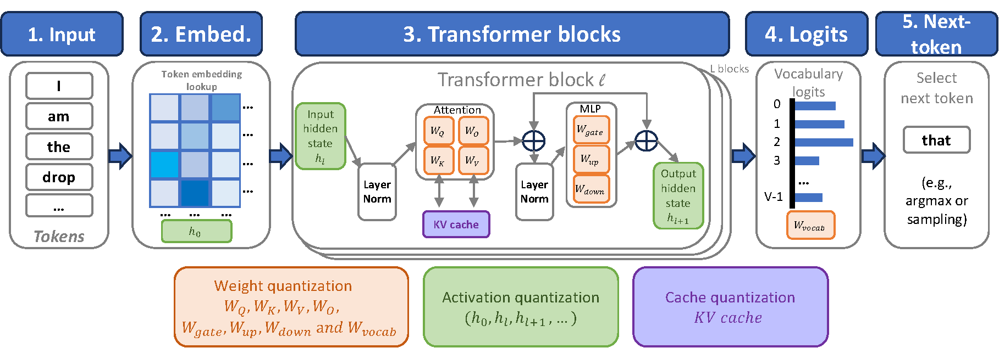
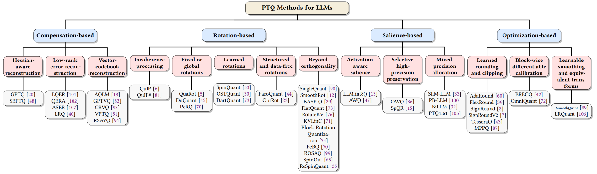

# Post-Training Quantization for Large Language Models: A Survey

Methods, component sensitivity, calibration, and deployment

[Manuscript](paper/survey.pdf) · [Method catalog](#methods) · [Full bibliography](docs/references.md) · [Reported results](docs/reported-results.md) · [Citation](#citation)

[Baha Rababah](mailto:rababahb@myumanitoba.ca), [Yuzhang Shang](mailto:yuzhang.shang@ucf.edu), [Carson K. Leung](mailto:carson.leung@umanitoba.ca), [Cuneyt G. Akcora](mailto:cuneyt.akcora@ucf.edu), and [Mubarak Shah](mailto:mubarak.shah@ucf.edu)

University of Manitoba and University of Central Florida. 

This repository accompanies the survey and organizes its literature around one question: How does each method control quantization error? It connects the methods to the transformer components they affect, the calibration information they use, and the numerical formats and kernels required for deployment. The catalog contains 52 method entries from Section 3 and an index of all 108 references in the manuscript.

The four method families are compensation, rotation, salience, and optimization. The survey adopts this taxonomy from Zhao et al. [104](docs/references.md#ref-104) and assigns hybrid methods by their primary error-control mechanism. This repository preserves those assignments and records important secondary mechanisms in each entry.

<p align="center">
  
</p>

Figure 1 from the manuscript, page 4. Weights, runtime activations, and cached keys and values are separate quantization targets; their memory costs and error paths differ.

<a id="edition"></a>
## Edition and scope

| Edition | Contents |
| --- | --- |
| 6 September 2026 | Companion prepared from the supplied 35-page manuscript and main LaTeX source. Includes 52 method entries, 108 references, eight extracted figures, structured metadata, and source notes. |

Method descriptions and publication labels follow the supplied survey. External links provide access to primary paper records and author projects; link matching does not independently verify every reported result or establish current implementation support. This is a literature companion, and the package contains no new quantization implementation or reproduced benchmark. The [source notes](docs/source-notes.md) identify inconsistencies that should be resolved before a public release.

<a id="contents"></a>
## Contents

| Section | Coverage |
| --- | --- |
| [Background](#background) | Error definitions, quantization scope, number systems, granularity, and inference phases. |
| [Taxonomy](#methods) | Four error-control families and rules for reading hybrid methods. |
| [Compensation](#compensation) | Hessian-aware reconstruction, low-rank reconstruction, and vector codebooks. |
| [Rotation](#rotation) | Incoherence, fixed and learned rotations, structured transforms, and specialized settings. |
| [Salience](#salience) | Activation-aware scaling, selective preservation, mixed precision, and binary regimes. |
| [Optimization](#optimization) | Rounding, clipping, block reconstruction, smoothing, and data-free balancing. |
| [Component sensitivity](#components) | Attention, MLP projections, KV cache, normalization, residual paths, and output logits. |
| [Calibration](#calibration) | Range fitting, distribution matching, reconstruction scope, activation statistics, and data selection. |
| [Research directions](#research-directions) | Formats and kernels, extreme precision, emerging architectures, inference workloads, and reliability. |
| [Evaluation](#evaluation) | Evaluation resources and the information needed to interpret reported results. |
| [Libraries and implementations](#implementations) | Author repositories and systems resources cited in the survey. |
| [Related surveys](#related-surveys) | Background and neighboring surveys from the bibliography. |
| [Repository files](#repository-files) | Documents, figures, structured indexes, and validation tools. |
| [Contributing](#contributing) | Entry requirements and evidence rules. |
| [Citation](#citation) | Manuscript citation without unconfirmed publication metadata. |
| [License and source status](#license) | Author decisions still required for publication and reuse. |

<a id="background"></a>
## Background

Post-training quantization converts a pretrained model to lower-precision representations after training. The survey treats the resulting approximation error as the common object across methods. For a linear layer with row-stacked inputs, $Y=XW$. If $\widetilde W$ denotes the dequantized low-bit weights, the weight error is $E=W-\widetilde W$ and the induced projection error is $\Delta Y=XE$. The input activations determine how a weight perturbation affects the output. See [Section 2](paper/survey.pdf#page=3).

The shorthand W4A8 denotes 4-bit weights and 8-bit activations. It does not specify the KV-cache precision, quantization groups, codebook storage, retained high-precision components, or compute format of every operation. Those details are needed to compare methods with the same nominal precision.

| Design dimension | Choices discussed in the survey | Why the choice matters |
| --- | --- | --- |
| Quantized tensors | Weights; weights and activations; cached keys and values. | Static weights can be processed offline. Activations and cached states depend on the input and generation process. |
| Quantization levels | Uniformly spaced values; non-uniform reconstruction values and codebooks. | The representation determines how limited levels fit the tensor distribution and how values are decoded. |
| Granularity | Per-tensor, per-channel, and per-group parameters. | Local scales can fit heterogeneous values more closely, with additional metadata and scaling work. |
| Precision assignment | Uniform precision; structured mixed precision; selected higher-precision entries or channels. | Selective precision changes the storage budget and may require separate execution paths. |
| Inference phase | Prefill and autoregressive decoding. | Prefill processes the prompt and builds the cache. Decode repeatedly uses cached states while producing new tokens. |
| Storage and execution | Packed values, scales, zero-points, indices, codebooks, correction matrices, and online transforms. | A compact representation must be evaluated together with the operations needed to execute it. |

Uniform quantization shares a fixed step between adjacent reconstruction values. Non-uniform quantization uses unevenly spaced reconstruction values; vector quantization extends the representation to groups of weights. The survey’s distinction between structured and unstructured access is also important: channel- or group-level selections can use regular layouts, while arbitrary preserved entries require location information and a suitable execution path. See [Section 2](paper/survey.pdf#page=5).

<a id="methods"></a>
## Taxonomy of error-control mechanisms

| Family | Primary question | Mechanisms | Entries |
| --- | --- | --- | --- |
| [Compensation](#compensation) | How can the quantization error be corrected? | Sequential curvature-aware updates, compact residual terms, and vector-codebook reconstruction. | 11 |
| [Rotation](#rotation) | How can transformed coordinates make quantization easier? | Incoherence processing, orthogonal rotations, structured transforms, and related distribution reshaping. | 22 |
| [Salience](#salience) | Which parts need protection from precision loss? | Activation-aware scaling, preserved columns or entries, structured bit allocation, and binary masks. | 8 |
| [Optimization](#optimization) | Which quantizer choices best preserve the selected output? | Learned rounding, clipping, scales, block reconstruction, and equivalent transformations. | 11 |

These families overlap. SEPTQ combines compensation and selective preservation; QuIP# combines rotations and codebooks; ROSAQ combines rotation and salience; several optimization methods use low-rank scaling. The family label records the survey’s organizing choice. The mechanism and deployment columns provide the additional information needed to interpret it. See [Section 3](paper/survey.pdf#page=7).

<details>
<summary>Original taxonomy figure from the manuscript</summary>

<p align="center">
  
</p>

Figure 2, page 7, is preserved as supplied. The method catalog follows the full Section 3 discussion: the original figure omits KurTail, ButterflyQuant, and SINQ and repeats PeRQ. See [source notes](docs/source-notes.md#taxonomy-coverage).

</details>

Each method name links to a primary paper record. The numbered reference links to its complete citation in this repository. Years and venues are taken from the supplied bibliography and may differ from the first arXiv posting date. “Author code” is shown where an author-linked project was identified; its absence means no such link was included in this preparation. The deployment column summarizes costs and reporting considerations discussed in the survey, not results from an implementation audit.

<a id="compensation"></a>
## Compensation-based methods

Compensation methods preserve the behavior of a projection through error correction or reconstruction. The survey separates sequential curvature-aware updates, low-rank reconstruction, and vector-codebook reconstruction. For a low-rank correction, the effective matrix is $W_{\mathrm{rec}}=\widetilde W+A_kB_k$; both the quality of the correction and its deployed cost matter. See [Section 3.1](paper/survey.pdf#page=8).

<p align="center">
  
</p>

Figure 3, page 7: Hessian-aware minimization, low-rank error reconstruction, and vector-codebook reconstruction.

### Hessian-aware reconstruction

The reconstruction signal comes from the outputs produced on calibration inputs. GPTQ uses the quadratic structure induced by $H=2X^\top X$ to propagate rounding error to weights that have not yet been quantized.

| Method and source | Error-control mechanism | Setting and deployment considerations |
| --- | --- | --- |
| <a id="method-20"></a>[GPTQ](https://arxiv.org/abs/2210.17323) · [20](docs/references.md#ref-20)<br>arXiv, 2022<br>[Author code](https://github.com/IST-DASLab/gptq) | Preserves linear projection outputs on calibration activations. It uses a second-order reconstruction objective, sequential rounding, inverse-Hessian error updates, lazy block updates, and a Cholesky reformulation. | Weight-only; 3-bit and 4-bit examples. Calibration requires activation statistics and curvature operations. Low-bit storage needs a compatible inference kernel. |
| <a id="method-48"></a>[SEPTQ](https://dl.acm.org/doi/10.1145/3690624.3709287) · [48](docs/references.md#ref-48)<br>KDD, 2025 | Combines a static importance mask with sequential Hessian-guided compensation. Selected important weights retain their original values; the other weights use the low-bit approximation. | Weight-only; selective higher precision. Count preserved values and mask/index storage in the effective bit budget. Selective storage can introduce a separate high-precision path. |

### Low-rank error reconstruction

LQER and QERA use an additive correction. LRQ is included in this subsection by the source, but its learned low-rank object is a weight-scaling matrix. The entries retain this distinction.

| Method and source | Error-control mechanism | Setting and deployment considerations |
| --- | --- | --- |
| <a id="method-101"></a>[LQER](https://arxiv.org/abs/2402.02446) · [101](docs/references.md#ref-101)<br>ICML, 2024<br>[Author code](https://github.com/ChengZhang-98/lqer) | Approximates activation-scaled quantization error with a low-rank factorization. The deployed output combines the low-bit projection with a compact high-precision correction. | Weight and activation; W4A8 example. Include both correction matrices and their two matrix multiplications in memory and latency measurements. |
| <a id="method-102"></a>[QERA](https://arxiv.org/abs/2410.06040) · [102](docs/references.md#ref-102)<br>ICLR, 2025<br>[Author code](https://github.com/ChengZhang-98/QERA) | Derives an analytical low-rank correction from the calibration-output discrepancy. Its objective accounts for the inputs that multiply the weight error. | Weight-only error reconstruction. The residual correction is an extra deployed term. Rank selection controls its storage and compute cost. |
| <a id="method-107"></a>[ASER](https://arxiv.org/abs/2411.07762) · [107](docs/references.md#ref-107)<br>AAAI, 2025 | Combines activation smoothing with low-rank reconstruction of weight-and-activation quantization error. Smoothing reduces outlier pressure before the correction recovers part of the output behavior. | Weight and activation; W4A8 and W4A6 examples. The correction rank, activation precision, and per-channel configuration must accompany any reported result. |
| <a id="method-40"></a>[LRQ](https://aclanthology.org/2025.naacl-long.393/) · [40](docs/references.md#ref-40)<br>NAACL, 2025<br>[Author code](https://github.com/robotseye/FlexRound_LRQ) | Learns low-rank weight-scaling matrices through block reconstruction. The low-rank parameterization allows more flexible scaling than independent channel scales with fewer parameters than element-wise scaling. | Weight and activation; W8A8 and W4A8. Its low-rank object is a scaling parameterization. It is not the additive residual term used by LQER and QERA. [Source note](docs/source-notes.md). |

### Vector-codebook reconstruction

These methods replace groups of weights with codebook indices. Their storage includes the codebooks and any residual or outlier representation; their execution includes decoding or lookup work.

| Method and source | Error-control mechanism | Setting and deployment considerations |
| --- | --- | --- |
| <a id="method-18"></a>[AQLM](https://arxiv.org/abs/2401.06118) · [18](docs/references.md#ref-18)<br>ICML, 2024<br>[Author code](https://github.com/vahe1994/AQLM) | Reconstructs each weight vector as the sum of entries from several learned codebooks. Calibration preserves projection and transformer-block outputs, and codebook parameters are tuned jointly. | Weight-only; approximately 2–3 bits per parameter. Account for codebooks, indices, lookup work, and any adaptation stage. Nominal index precision alone does not describe total storage. |
| <a id="method-83"></a>[GPTVQ](https://arxiv.org/abs/2402.15319) · [83](docs/references.md#ref-83)<br>arXiv, 2024<br>[Author code](https://github.com/Qualcomm-AI-research/gptvq) | Splits weights into groups with small vector codebooks and index tables. The survey describes a storage-oriented implementation that decodes indices to a native compute type for matrix multiplication. | Weight-only; mobile CPU setting. Benefits depend on memory traffic and decoding cost on the target processor. Mobile CPU results are not GPU throughput measurements. |
| <a id="method-93"></a>[CRVQ](https://arxiv.org/abs/2412.09282) · [93](docs/references.md#ref-93)<br>TACL, 2025 | Assigns a base codebook to all groups and extra codebooks to important channels. A Hessian-related score ranks channels before they are reordered into critical groups. | Weight-only; sub-2-bit settings. The average rate depends on how many groups receive extension codebooks. Include the channel allocation and all codebook storage. |
| <a id="method-51"></a>[VPTQ](https://arxiv.org/abs/2409.17066) · [51](docs/references.md#ref-51)<br>EMNLP, 2024<br>[Author code](https://github.com/microsoft/VPTQ) | Uses second-order information for vector reconstruction, a residual codebook for the error left by the first codebook, and a separate configuration for difficult vectors. | Weight-only; 2-bit examples. Report residual and outlier configurations with decoding throughput. The paper-specific comparison does not establish a hardware-independent ranking. |
| <a id="method-94"></a>[RSAVQ](https://arxiv.org/abs/2510.01240) · [94](docs/references.md#ref-94)<br>NeurIPS, 2025 | Uses Fisher-information-based sensitivity to shape vector quantization error and allocate more precision to sensitive channels. Both error direction and unequal channel sensitivity enter the design. | Weight-only; 2-bit example. Sensitivity estimation and heterogeneous allocation add calibration and representation costs. Record the complete bit budget. |

The central comparison within this family is the object being reconstructed. A good entry-wise weight fit, an activation-weighted projection fit, and a full-block fit are different objectives. The survey’s [reported numerical examples](docs/reported-results.md) retain their original model and precision settings so they are not read as a common leaderboard.

<a id="rotation"></a>
## Rotation-based methods

Rotation methods change the coordinates in which quantization is performed. For an orthogonal matrix $Q$, the full-precision identity is $XW=(XQ)(Q^\top W)$. The survey studies how this transformation redistributes difficult values and how related scaling, permutation, correction, and mixed-precision operations affect the result. Some transforms can be incorporated into stored weights; others remain online. See [Section 3.2](paper/survey.pdf#page=11).

<details>
<summary>Original rotation illustration from the manuscript</summary>

<p align="center">
  
</p>

Figure 4, page 12, is reproduced without alteration. Its transform hierarchy and several labels need mathematical revision; the [source notes](docs/source-notes.md#rotation-mathematics) explain the issues. The catalog does not rely on the diagram’s claimed set inclusions.

</details>

### Incoherence-based rotations

QuIP and QuIP# connect transformed coordinates to low-bit reconstruction. The source presents guarantees for this setting; these should be kept separate from claims about complete-model task degradation.

| Method and source | Error-control mechanism | Setting and deployment considerations |
| --- | --- | --- |
| <a id="method-6"></a>[QuIP](https://arxiv.org/abs/2307.13304) · [6](docs/references.md#ref-6)<br>NeurIPS, 2023<br>[Author code](https://github.com/Cornell-RelaxML/QuIP) | Applies randomized orthogonal preprocessing to weights and the curvature information used for adaptive rounding. The survey presents it as a low-bit method with theoretical guarantees. | Weight-only. Separate theoretical reconstruction guarantees from downstream task guarantees. Record the entire preprocessing and inference path. [Source note](docs/source-notes.md). |
| <a id="method-81"></a>[QuIP#](https://arxiv.org/abs/2402.04396) · [81](docs/references.md#ref-81)<br>ICML, 2024<br>[Author code](https://github.com/Cornell-RelaxML/quip-sharp) | Combines randomized Hadamard incoherence processing, lattice codebooks based on E8, and a brief fine-tuning stage. The structured transform reduces preprocessing cost. | Weight-only; 2-bit examples. Include codebook decoding and the reported fine-tuning stage when comparing calibration budgets or training-free claims. |

### Fixed and structured rotations

The survey distinguishes data-independent transforms from outlier-aware constructions. A training-free transform can still use activation statistics or require online operations.

| Method and source | Error-control mechanism | Setting and deployment considerations |
| --- | --- | --- |
| <a id="method-5"></a>[QuaRot](https://arxiv.org/abs/2404.00456) · [5](docs/references.md#ref-5)<br>NeurIPS, 2024<br>[Author code](https://github.com/spcl/QuaRot) | Uses randomized Hadamard rotations across the residual stream and selected attention/MLP paths. Two rotations are fused into weights; query/key and down-projection transforms are applied online. | Weights, activations, and KV cache; 4-bit pipeline. The whole pipeline is not free of online transforms. Report prefill and decode separately and include the cache configuration. |
| <a id="method-45"></a>[DuQuant](https://arxiv.org/abs/2406.01721) · [45](docs/references.md#ref-45)<br>NeurIPS, 2024<br>[Author code](https://github.com/Hsu1023/DuQuant) | Uses outlier-aware block rotations, a zigzag permutation to balance blocks, and a smoothing rotation. The construction uses distribution information without learned dense rotation parameters. | Weights and activations. Training-free construction still has preprocessing and calibration requirements. Permutation and block layout must fit the implementation. |

### Learned rotations

These methods estimate transforms from calibration signals. Their objectives include output preservation and distributional proxies; the optimization cost and the deployed transform are separate concerns.

| Method and source | Error-control mechanism | Setting and deployment considerations |
| --- | --- | --- |
| <a id="method-53"></a>[SpinQuant](https://arxiv.org/abs/2405.16406) · [53](docs/references.md#ref-53)<br>ICLR, 2025<br>[Author code](https://github.com/facebookresearch/SpinQuant) | Learns fusible residual and attention-path rotations on the orthogonal manifold. It retains the fixed online Hadamard transforms used for the other QuaRot paths. | Weights, activations, and KV cache. Dense rotation parameters and backpropagation increase calibration cost. Learned fusible rotations do not remove all online work. |
| <a id="method-30"></a>[OSTQuant](https://arxiv.org/abs/2501.13987) · [30](docs/references.md#ref-30)<br>ICLR, 2025<br>[Author code](https://github.com/BrotherHappy/OSTQuant) | Jointly learns orthogonal rotations and diagonal scaling. Its quantization-space utilization analysis motivates fitting the transformed distributions to the quantizer. | Weights, activations, and KV cache. Record the learned transformations, loss, and full target configuration. Scaling and rotation are distinct transformation families. |
| <a id="method-2"></a>[KurTail](https://arxiv.org/abs/2503.01483) · [2](docs/references.md#ref-2)<br>arXiv, 2025 | Minimizes the kurtosis of rotated activations layer by layer. The survey uses it to illustrate learning a distributional proxy with reduced memory demands. | Weights, activations, and KV cache in Table 3. Its proxy uses activations. It should not be grouped with parameter-only rotation methods merely because the objective is a moment statistic. |
| <a id="method-73"></a>[DartQuant](https://arxiv.org/abs/2511.04063) · [73](docs/references.md#ref-73)<br>NeurIPS, 2025<br>[Author code](https://github.com/CAS-CLab/DartQuant) | Uses distribution-aware calibration constraints with QR-based orthogonalization. The survey presents it as a lower-cost way to obtain quantization-friendly rotations. | Weights and activations. Compare its calibration cost under the same layer scope and sample budget as other learned rotations. |

### Structured and data-free rotations

Structure constrains how a transform is represented and executed. Data-free construction constrains which information is used to obtain it. These are independent design choices.

| Method and source | Error-control mechanism | Setting and deployment considerations |
| --- | --- | --- |
| <a id="method-91"></a>[ButterflyQuant](https://arxiv.org/abs/2509.09679) · [91](docs/references.md#ref-91)<br>arXiv, 2025 | Parameterizes an orthogonal butterfly transform with continuous Givens angles and a uniformity regularizer. The structure reduces the transform parameter count and computation. | Ultra-low-bit activations; 2-bit example. Structured transforms can still run online. Report runtime transform cost separately from the reduction in calibration parameters. |
| <a id="method-44"></a>[ParoQuant](https://arxiv.org/abs/2511.10645) · [44](docs/references.md#ref-44)<br>ICLR, 2026<br>[Author code](https://github.com/z-lab/paroquant) | Uses independent pairwise Givens rotations together with channel-wise scaling. The survey connects the method to quantization errors in long reasoning generations. | Reasoning models; the cited 2.4% result is weight-only. Measure the cost of pairwise transforms in the deployed setting. The public abstract places the cited reasoning improvement in a weight-only setting and also discusses weight-activation results. [Source note](docs/source-notes.md). |
| <a id="method-23"></a>[OptRot](https://arxiv.org/abs/2512.24124) · [23](docs/references.md#ref-23)<br>Machine Learning for Systems, 2025 | Learns rotations from a weight-only fourth-power objective. The source separately describes OptRot+ as a data-dependent variant with activation-covariance information. | Weight-only; OptRot+ adds activation information. Keep the data-free and activation-informed variants separate in comparisons. A data-free objective can still require optimization. |

### Beyond orthogonality and distribution reshaping

This source subsection groups closed-form rotations with methods that add scaling, bias correction, or more general invertible maps. The heading does not imply that every listed method uses a non-orthogonal transform.

| Method and source | Error-control mechanism | Setting and deployment considerations |
| --- | --- | --- |
| <a id="method-90"></a>[SingleQuant](https://arxiv.org/abs/2511.22316) · [90](docs/references.md#ref-90)<br>arXiv, 2025 | Constructs closed-form Givens alignment and uniformity rotations. The source uses it to discuss smoothing large outliers without iterative manifold optimization. | Weights and activations; W4A4. Its transforms remain orthogonal. The broader subsection title does not mean that this particular method uses a general affine map. |
| <a id="method-12"></a>[SmoothRot](https://arxiv.org/abs/2506.05413) · [12](docs/references.md#ref-12)<br>IEEE SMC, 2025<br>[Author code](https://github.com/czakop/smoothrot) | Combines SmoothQuant-style channel scaling with a fixed Hadamard rotation. Scaling first moderates large activation ranges; rotation redistributes the remaining concentration. | Weights and activations. Distinguish fused scales from online Hadamard operations. A measured small overhead is not evidence that no transform is executed. |
| <a id="method-29"></a>[BASE-Q](https://arxiv.org/abs/2506.15689) · [29](docs/references.md#ref-29)<br>arXiv, 2025<br>[Author code](https://github.com/Heliulu/BASE-Q) | Adds bias correction and asymmetric scaling to a fixed rotation. The design addresses channel-mean offsets and asymmetric ranges through explicit additional operations. | Weights and activations. Record which correction parameters are absorbed offline and which operations remain in the deployed kernel. |
| <a id="method-78"></a>[FlatQuant](https://arxiv.org/abs/2410.09426) · [78](docs/references.md#ref-78)<br>ICML, 2025<br>[Author code](https://github.com/ruikangliu/FlatQuant) | Learns per-linear-layer invertible transformations with a Kronecker parameterization. Its implementation fuses the online transform with quantization. | Weights and activations; cache flag differs across source tables. The transform is more general than an orthogonal rotation. Kernel fusion reduces overhead but does not imply zero extra arithmetic. [Source note](docs/source-notes.md). |

### Specialized cache and format settings

Cache placement, positional operations, block scales, and selective precision impose additional design constraints. The entries retain their specific target settings.

| Method and source | Error-control mechanism | Setting and deployment considerations |
| --- | --- | --- |
| <a id="method-76"></a>[RotateKV](https://www.ijcai.org/proceedings/2025/690) · [76](docs/references.md#ref-76)<br>IJCAI, 2025<br>[Author code](https://github.com/ZunhaiSu/RotateKV) | Uses outlier-aware adaptive Hadamard rotations, channel reordering, grouped-head handling before rotary position encoding, and protection for attention-sink tokens. | KV cache; 2-bit examples. Report key/value layouts, protected tokens, rotation placement, and all retained high-precision cache storage. |
| <a id="method-71"></a>[KVLinC](https://arxiv.org/abs/2510.05373) · [71](docs/references.md#ref-71)<br>arXiv, 2025 | Combines a Hadamard transform on values with small linear corrections for key-quantization error. Rotation and correction address different parts of attention. | KV cache. The correction adapters and online transform must be included in memory and latency accounting. |
| <a id="method-74"></a>[Block Rotation Quantization](https://arxiv.org/abs/2511.04214) · [74](docs/references.md#ref-74)<br>ICML, 2026 | Matches the rotation block to the microscaling block used by the numeric format. The source presents this as a response to conflicts between global rotations and shared block scales. | Weights and activations; MXFP4. Preserve the format, group size, scale format, and kernel assumptions. A generic INT4 result does not establish MXFP4 performance. |
| <a id="method-70"></a>[PeRQ](https://arxiv.org/abs/2601.22347) · [70](docs/references.md#ref-70)<br>arXiv, 2026 | Balances pre-rotation L1 mass across blocks with a permutation before block Hadamard transforms. The source relates the analysis to the empirical rotation-and-permutation design of DuQuant. | Weights and activations; block rotations. Use one catalog entry despite its repeated appearance in the original taxonomy figure. The primary arXiv record confirms the PeRQ name. [Source note](docs/source-notes.md). |
| <a id="method-99"></a>[ROSAQ](https://arxiv.org/abs/2506.13472) · [99](docs/references.md#ref-99)<br>arXiv, 2025 | Uses a closed-form principal-component rotation to align sensitive directions with selected components, then retains those directions in higher precision. | Weight quantization with salient FP16 directions. This is a rotation-and-salience hybrid. Include the protected directions in the effective precision and runtime cost. |

### Robustness and offline/online trade-offs

| Method and source | Error-control mechanism | Setting and deployment considerations |
| --- | --- | --- |
| <a id="method-65"></a>[SpinOut](https://ieeexplore.ieee.org/document/11394731/) · [65](docs/references.md#ref-65)<br>IEEE Access, 2026 | Injects artificial outliers during rotation training in a selected subset of sensitive layers. Layer scores and performance criteria determine where to apply the intervention. | Weights, activations, and KV cache. Separate layer search, rotation training, and calibration data requirements from inference cost. |
| <a id="method-35"></a>[ReSpinQuant](https://arxiv.org/abs/2604.11080) · [35](docs/references.md#ref-35)<br>ICML, 2026 | Refolds learned layer-wise rotations into weights and approximates the resulting basis mismatch with a subspace residual rotation. The objective is to retain layer-wise accuracy at low runtime cost. | Weights and activations; W4A4 and W3A3. The residual approximation is part of the method. Record its accuracy and overhead alongside the fused transformations. |

FrameQuant is discussed beside this family but is explicitly excluded from rotation-based methods in the manuscript: it uses overcomplete fusion frames. It is available through [FrameQuant](https://proceedings.mlr.press/v235/adepu24a.html) · [1](docs/references.md#ref-1) and its [author implementation](https://github.com/vsingh-group/FrameQuant). It is not included in the 22 rotation entries.

<a id="salience"></a>
## Salience-based methods

Salience methods allocate protection according to the effect of a perturbation on projection outputs or downstream behavior. The source considers activation magnitude, weight magnitude, curvature information, output reconstruction, and outlier statistics as importance signals. Protection may take the form of a scale transformation, higher-precision values, or a structured bit allocation. See [Section 3.3](paper/survey.pdf#page=15).

<p align="center">
  
</p>

Figure 5, page 16: activation-aware scaling, selective higher-precision preservation, and salience-weighted bit allocation.

### Activation-aware salience

| Method and source | Error-control mechanism | Setting and deployment considerations |
| --- | --- | --- |
| <a id="method-13"></a>[LLM.int8()](https://arxiv.org/abs/2208.07339) · [13](docs/references.md#ref-13)<br>NeurIPS, 2022<br>[Author code](https://github.com/bitsandbytes-foundation/bitsandbytes) | Uses vector-wise 8-bit computation for ordinary features and a 16-bit decomposition for the outlier feature dimensions. Activation outliers determine which dimensions receive special treatment. | 8-bit matrix multiplication with an FP16 outlier path. The effective execution is mixed precision. Include outlier extraction and the high-precision multiplication. |
| <a id="method-47"></a>[AWQ](https://arxiv.org/abs/2306.00978) · [47](docs/references.md#ref-47)<br>MLSys, 2024<br>[Author code](https://github.com/mit-han-lab/llm-awq) | Uses activation statistics to identify important weight channels and searches equivalent channel scales that preserve projection outputs. The full-precision product is unchanged before quantization. | Weight-only; low-bit dense representation. Salient channels are protected through scaling. The survey explicitly states that the final quantized matrix does not keep separate FP16 outlier weights. |

### Selective high-precision preservation

The shape of the protected subset matters. A stored column and a collection of arbitrary entries impose different metadata and memory-access requirements.

| Method and source | Error-control mechanism | Setting and deployment considerations |
| --- | --- | --- |
| <a id="method-36"></a>[OWQ](https://arxiv.org/abs/2306.02272) · [36](docs/references.md#ref-36)<br>AAAI, 2024<br>[Author code](https://github.com/xvyaward/owq) | Identifies weak columns that are particularly sensitive to quantization and preserves them at higher precision. The paper also includes Weak Column Tuning as a limited adaptation step. | Weight-only; selected high-precision columns. Include the preserved columns and any tuning stage. Structured preservation differs from arbitrary sparse weight exceptions. |
| <a id="method-15"></a>[SpQR](https://arxiv.org/abs/2306.03078) · [15](docs/references.md#ref-15)<br>ICLR, 2024<br>[Author code](https://github.com/Vahe1994/SpQR) | Separates weights with unusually large quantization error into a sparse higher-precision representation. The dense remainder is quantized with group-wise scales. | Weight-only; approximately 3–4 bits per parameter. The sparse component needs values, indices, and decoding support. Include these costs when reporting compression. |

### Structured mixed precision and binary salience

Average bit-width depends on the precision allocation, scales, masks, and residual representation. Binary or sub-2-bit labels must be read with those details.

| Method and source | Error-control mechanism | Setting and deployment considerations |
| --- | --- | --- |
| <a id="method-33"></a>[SliM-LLM](https://arxiv.org/abs/2405.14917) · [33](docs/references.md#ref-33)<br>ICML, 2025<br>[Author code](https://github.com/Aaronhuang-778/SliM-LLM) | Assigns bit-widths to groups according to salience structure and calibrates quantizers with element-level salience weights. The allocation avoids arbitrary sparse exceptions. | Group-level mixed-precision weights. Report the distribution of group precisions and metadata. SliM-LLM is distinct from the joint-compression method SLiM in reference [58]. |
| <a id="method-100"></a>[PB-LLM](https://arxiv.org/abs/2310.00034) · [100](docs/references.md#ref-100)<br>ICLR, 2024<br>[Author code](https://github.com/hahnyuan/PB-LLM) | Protects salient weights at higher precision and binarizes the remaining weights. Its PTQ variant uses Hessian-guided reconstruction; the source also discusses a training-aware variant. | Partially binarized weights with a protected subset. Partial binarization is not uniform one-bit storage. State the protected fraction and whether the PTQ or training-aware variant is used. |
| <a id="method-32"></a>[BiLLM](https://proceedings.mlr.press/v235/huang24q.html) · [32](docs/references.md#ref-32)<br>ICML, 2024<br>[Author code](https://github.com/Aaronhuang-778/BiLLM) | Separates salient and non-salient weights, applies binary residual approximation to the salient part, and uses distribution-guided splitting for the remaining weights. | Binary-weight PTQ with salience-dependent treatment. Count all binary residual components, scales, and partition information. A one-bit label alone does not describe the full representation. |
| <a id="method-105"></a>[PTQ1.61](https://arxiv.org/abs/2502.13179) · [105](docs/references.md#ref-105)<br>ACL, 2025<br>[Author code](https://github.com/zjq0455/PTQ1.61) | Uses an activation-derived one-dimensional mask to select salient channels for 4-bit quantization. Other channels are binarized with block-wise scale optimization and preprocessing. | Sub-2-bit weights; salient channels at 4 bits. The reported average rate depends on the mask and allocation. Preserve the distinction between structured channel selection and element-wise masks. |

<a id="optimization"></a>
## Optimization-based methods

Optimization methods treat rounding, clipping, scales, or transformations as quantities to estimate during quantization. The source includes calibration-driven learning and parameter-only balancing in this family. It also includes foundational pre-LLM work where that work establishes a principle used by later LLM methods. See [Section 3.4](paper/survey.pdf#page=18).

<p align="center">
  
</p>

Figure 6, page 18: rounding and clipping, block-wise differentiable calibration, and equivalent transformations. The [source notes](docs/source-notes.md#figure-notation) record notation issues in the original illustration.

### Learned rounding and clipping

The quantizer chooses among discrete reconstruction values, but the calibration objective can measure error after a complete projection or block. The nearest weight value need not be the choice with the smallest output discrepancy.

| Method and source | Error-control mechanism | Setting and deployment considerations |
| --- | --- | --- |
| <a id="method-60"></a>[AdaRound](https://arxiv.org/abs/2004.10568) · [60](docs/references.md#ref-60)<br>ICML, 2020 | Learns up-or-down rounding decisions by minimizing local output reconstruction error on unlabeled calibration data. It motivates choosing grid assignments through the computation they affect. | Foundational PTQ; predates LLM-scale methods. Treat it as a foundational method. Inclusion in an LLM survey is not evidence of an original LLM-scale evaluation. |
| <a id="method-39"></a>[FlexRound](https://proceedings.mlr.press/v202/lee23h.html) · [39](docs/references.md#ref-39)<br>ICML, 2023<br>[Author code](https://github.com/robotseye/FlexRound_LRQ) | Uses element-wise division to learn weight positions relative to the quantization grid together with a common grid scale. Calibration reconstructs blocks. | Weights and activations; W8A8 example. Element-level calibration parameters increase optimization cost. The deployed representation should be described separately from calibration variables. |
| <a id="method-8"></a>[SignRound](https://aclanthology.org/2024.findings-emnlp.662/) · [8](docs/references.md#ref-8)<br>EMNLP Findings, 2024<br>[Author code](https://github.com/intel/auto-round) | Optimizes rounding and clipping using signed gradient updates. The survey describes a short calibration procedure whose learned decisions do not add inference-time parameters. | Low-bit weight quantization. Compare calibration budgets and objectives explicitly. The original SignRound and SignRoundV2 have distinct bibliography entries. |
| <a id="method-7"></a>[SignRoundV2](https://arxiv.org/abs/2512.04746) · [7](docs/references.md#ref-7)<br>arXiv, 2025<br>[Author code](https://github.com/intel/auto-round) | Extends signed-gradient rounding with adaptive precision allocation and stabilization steps, including loss filtering and scale search. It addresses settings where one bit-width for every layer is too restrictive. | Extremely low-bit weights; adaptive mixed precision. Account for mixed-precision assignments when comparing to uniform precision. The linked AutoRound project serves both paper records. |
| <a id="method-43"></a>[TesseraQ](https://arxiv.org/abs/2410.19103) · [43](docs/references.md#ref-43)<br>arXiv, 2024<br>[Author code](https://github.com/Intelligent-Computing-Lab-Yale/TesseraQ) | Uses progressive adaptive rounding during block reconstruction. Some continuous rounding variables become fixed binary choices while other variables and dequantization scales remain optimized. | Ultra-low-bit PTQ; 2-bit weight-only example. Specify the complete pipeline and reconstruction scope. Table 4 includes backend stages beyond the central rounding contribution. |
| <a id="method-87"></a>[MPPQ](https://www.ijcai.org/proceedings/2025/920) · [87](docs/references.md#ref-87)<br>IJCAI, 2025 | Combines layer- and block-level supervision with magnitude and directional agreement. It also uses low-rank scaling parameters and a short search to initialize clipping. | Weights and activations; W4A4 example. Report the loss, initialization search, and calibration settings. Its low-rank scaling should not be described as an additive deployed residual. |

### Block-wise differentiable calibration

A block-level objective includes interactions through attention, gating, normalization, and residual addition. The source distinguishes the original vision-oriented BRECQ study from the LLM-specific OmniQuant method.

| Method and source | Error-control mechanism | Setting and deployment considerations |
| --- | --- | --- |
| <a id="method-42"></a>[BRECQ](https://arxiv.org/abs/2102.05426) · [42](docs/references.md#ref-42)<br>ICLR, 2021<br>[Author code](https://github.com/yhhhli/BRECQ) | Uses a full block as the reconstruction unit so calibration can account for interacting errors inside residual and nonlinear computation. It is a methodological predecessor of later LLM block calibration. | Foundational block reconstruction; originally CNNs. The original study is not an LLM benchmark. Its role in the survey is the calibration principle. |
| <a id="method-72"></a>[OmniQuant](https://arxiv.org/abs/2308.13137) · [72](docs/references.md#ref-72)<br>ICLR, 2024<br>[Author code](https://github.com/OpenGVLab/OmniQuant) | Freezes pretrained weights and learns clipping thresholds and equivalent transformation parameters through block reconstruction. Calibration variables are incorporated into stored weights and scales. | Weight-only and weight-activation configurations. Separate calibration-time learning from additional inference modules. State the precise weight, activation, and cache configuration. |

### Smoothing and equivalent transformations

The shared idea is to alter tensor distributions while preserving the full-precision product. SmoothQuant chooses channel scales from statistics; LRQuant learns calibration parameters; SINQ balances weights without calibration inputs.

| Method and source | Error-control mechanism | Setting and deployment considerations |
| --- | --- | --- |
| <a id="method-89"></a>[SmoothQuant](https://arxiv.org/abs/2211.10438) · [89](docs/references.md#ref-89)<br>ICML, 2023<br>[Author code](https://github.com/mit-han-lab/smoothquant) | Uses activation and weight statistics to select diagonal scales. The transformation reduces activation ranges while moving part of the range into weights without changing the full-precision product. | Weight and activation; W8A8. The channel-scale rule is statistics-based. The source places it with optimization methods, but it does not require learned rounding or a dense learned rotation. |
| <a id="method-106"></a>[LRQuant](https://aclanthology.org/2024.acl-long.122/) · [106](docs/references.md#ref-106)<br>ACL, 2024<br>[Author code](https://github.com/zjq0455/RLQ) | Learns smoothing and quantization parameters with magnitude and directional output agreement. It initializes scales by logarithmic activation equalization and also describes last-block test-time adaptation. | Weights and activations; W4A4. Report whether test-time adaptation is enabled. Test-set adaptation and ordinary fixed-quantizer evaluation are different protocols. |
| <a id="method-59"></a>[SINQ](https://arxiv.org/abs/2509.22944) · [59](docs/references.md#ref-59)<br>ICML, 2026<br>[Author code](https://github.com/huawei-csl/SINQ) | Balances row and column standard deviations using a dampened Sinkhorn-Knopp-style procedure in log space. Weight statistics drive the scale computation without calibration inputs. | Calibration-free low-precision weights. Optimization-based placement does not imply use of external calibration text. Record which scale operations can be absorbed into adjacent computation. |

<a id="components"></a>
## Sensitivity of transformer components

The survey defines component sensitivity through the degradation caused by quantizing a particular tensor or module while the remaining computation is held fixed or calibrated. This is a location-dependent question: weight perturbations, attention-score perturbations, reused cache errors, and output-logit changes do not enter the computation in the same way. See [Section 4](paper/survey.pdf#page=21).

<p align="center">
  
</p>

Figure 7, page 22. The numbered sites distinguish outliers after normalization, query/key score changes, reused cache error, MLP inputs and outputs, and vocabulary-logit distortion.

| Component | Sensitivity described in the survey | Implication for quantization |
| --- | --- | --- |
| Query and key projections | Their errors perturb attention scores and can change how attention is distributed over earlier tokens. | Inspect attention behavior and the activations entering the projections; local weight error alone does not characterize the effect. |
| Value and output projections | Value errors change retrieved content. The output projection returns that content to the residual stream. | Measure projection and block outputs, and account for propagation into later blocks. |
| MLP up, gate, and down projections | Expansion inputs can contain large channel outliers. Down-projection errors enter the residual stream. | Large weight matrices offer storage savings, while lower-bit activations require careful clipping, smoothing, or reconstruction. |
| Key cache and value cache | Cached errors persist and are reused. Keys affect scores; values affect retrieved content. | Use explicit key/value settings and evaluate across context lengths. The source discusses channel-aware keys and token-aware values. |
| Normalization and residual paths | These operations influence the inputs and states used by many large projections. | Their small parameter count does not make them harmless targets. Record retained precision and fused transformations. |
| Embeddings, language-model head, and logits | The output path interacts directly with vocabulary probabilities. | Record exceptions in the final projection and evaluate generation behavior under the actual output configuration. |

The cache asymmetry is developed in [KIVI](https://proceedings.mlr.press/v235/liu24bz.html) · [52](docs/references.md#ref-52). The source does not provide a controlled component ablation across all 52 catalog methods, so this map is a synthesis of sensitivity mechanisms, not a ranking of every component for every model.

<a id="calibration"></a>
## Calibration strategies

Calibration estimates the information and parameters needed by a quantizer for a fixed pretrained model. The survey connects this step to range estimation, channel importance, reconstruction error, and transformation selection. The full-precision model can supply layer or block targets on unlabeled inputs. See [Section 5](paper/survey.pdf#page=24).

| Strategy | Information and objective | Source examples or discussion | Main issue to report |
| --- | --- | --- | --- |
| Range-based fitting | Observed minima and maxima; optional percentile clipping. | Section 5.1. | Granularity, clipping threshold, and treatment of persistent outlier channels. |
| Distributional fitting | Histograms and a distribution-discrepancy criterion. | Section 5.2; the FAIR-Calib citation needs checking in the source notes. | Histogram construction, objective, and whether preserving tensor values predicts the relevant functional behavior. |
| Layer-wise reconstruction | Projection outputs on shared calibration inputs. | AdaRound [60](docs/references.md#ref-60); GPTQ [20](docs/references.md#ref-20). | Reconstruction scope, data, curvature estimation, and the treatment of earlier quantized layers. |
| Block-wise reconstruction | Outputs of composed attention, MLP, nonlinear, and residual computation. | BRECQ [42](docs/references.md#ref-42); OmniQuant [72](docs/references.md#ref-72); SignRound [8](docs/references.md#ref-8); TesseraQ [43](docs/references.md#ref-43). | Optimization budget, trainable quantizer parameters, reconstruction objective, and validation protocol. |
| Activation-aware selection | Channel statistics that determine scaling or weight salience. | SmoothQuant [89](docs/references.md#ref-89); AWQ [47](docs/references.md#ref-47); LRQuant [106](docs/references.md#ref-106). | Representativeness of activation ranges, outliers, and deployment prompts. |
| Granularity-aware fitting | Parameter sharing at tensor, channel, group, or block scope. | Table 6. | Additional metadata and compatibility with the target kernel. |
| Calibration-data selection | Examples chosen to cover the intended prompt structure and sequence lengths. | Section 5.5. | Data source, sample count, token length, selection procedure, and separation from evaluation. |
| Parameter-only fitting | Pretrained weights and analytical or optimization-based statistics. | EasyQuant [79](docs/references.md#ref-79); AdpQ [24](docs/references.md#ref-24); SINQ [59](docs/references.md#ref-59); OptRot [23](docs/references.md#ref-23). | Assumptions that substitute for observed deployment activations. |

For a linear layer, reconstruction can compare $XW$ and $X\widetilde W$. A transformer-block objective compares the outputs of the composed block on the same inputs. These scopes have different calibration costs and preserve different aspects of behavior; neither should be described simply as “MSE calibration” without naming the quantity being matched. See [Section 5.3](paper/survey.pdf#page=25).

### Calibration data and information source

The survey warns that short generic text can fail to represent long prompts, dialogue, code, mathematics, or reasoning-heavy use cases. Calibration data should be described separately from the held-out data used to evaluate the quantized model. A larger sample count does not by itself demonstrate that the relevant activation patterns were covered. See [Sections 5.5–5.6](paper/survey.pdf#page=26).

The supplied Table 6 and Section 5.6 use “zero-shot” differently. This README therefore names the information source explicitly: real unlabeled text, model-generated sequences, or parameter-only statistics. This is an editorial reporting convention; it does not settle the manuscript’s inconsistent terminology. The original wording and proposed revision are in the [source notes](docs/source-notes.md#calibration-terminology).

| Paper or resource | Year in survey | Role in the survey |
| --- | --- | --- |
| [EasyQuant: An Efficient Data-free Quantization Algorithm for LLMs](https://aclanthology.org/2023.emnlp-main.565.pdf) · [79](docs/references.md#ref-79) | 2023 | Parameter-only range optimization with outlier treatment. |
| [AdpQ: A Zero-shot Calibration Free Adaptive Post Training Quantization Method for LLMs](https://arxiv.org/abs/2405.13358) · [24](docs/references.md#ref-24) | 2024 | Calibration-free adaptive treatment of salient and non-salient weights. |
| [Self-calibration for Language Model Quantization and Pruning](https://aclanthology.org/2025.naacl-long.509/) · [88](docs/references.md#ref-88) | 2025 | Self-generated calibration inputs for quantization and pruning. |
| [Zero-shot Quantization: A Comprehensive Survey](https://arxiv.org/abs/2505.09188) · [34](docs/references.md#ref-34) | 2025 | Background survey for checking zero-shot and data-free terminology. |

<a id="research-directions"></a>
## Research challenges and future directions

Section 6 organizes open questions around the interaction between the quantization algorithm, numeric format, kernel, and hardware. Its five clusters also include architecture-specific sensitivity, long-horizon inference, and reliability. The following sections preserve that organization; they summarize the supplied manuscript’s research agenda and do not claim an exhaustive current-state survey. See [Section 6](paper/survey.pdf#page=27).

<p align="center">
  
</p>

Figure 8, page 27. The format, algorithm, kernel, and hardware need compatible choices; reliability and evaluation apply across the stack.

### Format, kernel, and hardware co-design

The source discusses native FP4 formats, block-level scales, the interaction between rotations and block layouts, and the gap between storage reduction and realized execution speed. Its examples include MXFP4 and NVFP4, format-aware quantization, block rotations, and fused low-bit kernels. The research question is which quantizer and transformation fit the deployed numerical representation and execution path.

| Paper or resource | Year in survey | Role in the survey |
| --- | --- | --- |
| [Bridging the Gap Between Promise and Performance for Microscaling FP4 Quantization](https://arxiv.org/abs/2509.23202) · [17](docs/references.md#ref-17) | 2026 | Microscaling FP4 quantization and format-aware reconstruction. |
| [Pretraining Large Language Models with NVFP4](https://arxiv.org/abs/2509.25149) · [64](docs/references.md#ref-64) | 2025 | NVFP4 numerical-format background cited by the survey. |
| [Block Rotation is All You Need for MXFP4 Quantization](https://arxiv.org/abs/2511.04214) · [74](docs/references.md#ref-74) | 2026 | Block rotations matched to MXFP4 quantization. |
| [Pushing the Limits of Block Rotations in Post-Training Quantization](https://arxiv.org/abs/2601.22347) · [70](docs/references.md#ref-70) | 2026 | Permutation before block rotations and analysis of block structure. |
| [MARLIN: Mixed-Precision Auto-Regressive Parallel Inference on Large Language Models](https://dl.acm.org/doi/10.1145/3710848.3710871) · [21](docs/references.md#ref-21) | 2025 | Low-bit weight execution and kernel-level inference support. |

### Extreme low-bit accuracy and joint compression

The source identifies difficult cases below four bits, especially joint low-bit weights and activations. Its proposed directions include codebooks, incoherence processing, selective bit allocation, ternarization, recovery, and joint compression with sparsity or low-rank structure. The theoretical question concerns the relation between local reconstruction error and complete-model behavior; the source’s existing guarantees and its end-to-end claims need to be distinguished.

| Paper or resource | Year in survey | Role in the survey |
| --- | --- | --- |
| [PT2-LLM: Post-Training Ternarization for Large Language Models](https://openreview.net/forum?id=7QZanjCD6M) · [95](docs/references.md#ref-95) | 2026 | Post-training ternarization. |
| [VPTQ: Extreme Low-bit Vector Post-Training Quantization for Large Language Models](https://arxiv.org/abs/2409.17066) · [51](docs/references.md#ref-51) | 2024 | Extreme low-bit vector quantization. |
| [Ptq1. 61: Push the real limit of extremely low-bit post-training quantization methods for large language models](https://arxiv.org/abs/2502.13179) · [105](docs/references.md#ref-105) | 2025 | Structured sub-2-bit weight quantization. |
| [Quantization Error Propagation: Revisiting Layer-Wise Post-Training Quantization](https://arxiv.org/abs/2504.09629) · [4](docs/references.md#ref-4) | 2025 | Layer-wise quantization-error propagation. |
| [Optimal Brain Restoration for Joint Quantization and Sparsification of LLMs](https://openreview.net/forum?id=VQIvBpL5ag) · [28](docs/references.md#ref-28) | 2026 | Joint quantization and sparsification. |
| [SLiM: One-shot Quantization and Sparsity with Low-rank Approximation for LLM Weight Compression](https://arxiv.org/abs/2410.09615) · [58](docs/references.md#ref-58) | 2025 | Joint quantization, sparsity, and low-rank approximation. |

SliM-LLM [33](docs/references.md#ref-33) and SLiM [58](docs/references.md#ref-58) are different papers. The first concerns salience-driven mixed precision; the second concerns joint weight compression with sparsity and low-rank approximation. Their similarly spelled names should not be merged into one entry.

### Emerging architectures

Mixture-of-experts models add routing decisions and uneven expert coverage during calibration. Recurrent and state-space architectures reuse states across sequence positions. Multimodal models require attention to modality-specific statistics, while diffusion language models introduce denoising-step-dependent activations. The source treats these as distinct settings whose sensitive components and calibration requirements need dedicated study.

| Paper or resource | Year in survey | Role in the survey |
| --- | --- | --- |
| [Qmoe: Practical sub-1-bit compression of trillion-parameter models](https://arxiv.org/abs/2310.16795) · [19](docs/references.md#ref-19) | 2023 | Compression of mixture-of-experts models. |
| [EAQuant: Enhancing Post-Training Quantization for MoE Models via Expert-Aware Optimization](https://arxiv.org/abs/2506.13329) · [22](docs/references.md#ref-22) | 2025 | Expert-aware calibration and optimization. |
| [Dynamic Expert Quantization for Scalable Mixture-of-Experts Inference](https://arxiv.org/abs/2511.15015) · [10](docs/references.md#ref-10) | 2025 | Dynamic expert precision under changing usage. |
| [Mamba-PTQ: Outlier Channels in Recurrent Large Language Models](https://arxiv.org/abs/2407.12397) · [66](docs/references.md#ref-66) | 2024 | Outlier channels in recurrent language models. |
| [Quamba2: a robust and scalable post-training quantization framework for selective state space models](https://openreview.net/forum?id=Zm0Kper4yx) · [9](docs/references.md#ref-9) | 2025 | Quantization of selective state-space models. |
| [A Survey of Retentive Network](https://aclanthology.org/2026.findings-acl.256/) · [96](docs/references.md#ref-96) | 2026 | Retentive-network architecture background. |
| [Q-VLM: Post-training Quantization for Large Vision-Language Models](https://arxiv.org/abs/2410.08119) · [84](docs/references.md#ref-84) | 2024 | Vision-language quantization and cross-layer dependencies. |
| [MBQ: Modality-Balanced Quantization for Large Vision-Language Models](https://arxiv.org/abs/2412.19509) · [41](docs/references.md#ref-41) | 2025 | Modality-balanced quantization. |
| [VEQ: Modality-Adaptive Quantization for MoE Vision-Language Models](https://arxiv.org/abs/2602.01037) · [68](docs/references.md#ref-68) | 2026 | Modality-adaptive quantization for expert-based vision-language models. |
| [Large Language Diffusion Models](https://arxiv.org/abs/2502.09992) · [62](docs/references.md#ref-62) | 2025 | Diffusion-language-model background. |
| [MMaDA: Multimodal Large Diffusion Language Models](https://arxiv.org/abs/2505.15809) · [98](docs/references.md#ref-98) | 2025 | Multimodal diffusion-language-model background. |
| [Quantization Meets dLLMs: A Systematic Study of Post-training Quantization for Diffusion LLMs](https://arxiv.org/abs/2508.14896) · [46](docs/references.md#ref-46) | 2026 | Systematic quantization study for diffusion language models. |
| [Quant-dLLM: Post-Training Extreme Low-Bit Quantization for Diffusion Large Language Models](https://openreview.net/forum?id=HD7tuVakmR) · [103](docs/references.md#ref-103) | 2026 | Extreme low-bit quantization of diffusion language models. |
| [FAIR-Calib: Frontier-Aware Instability-Reweighted Calibration for Post-Training Quantization of Diffusion Large Language Models](https://arxiv.org/abs/2606.06547) · [31](docs/references.md#ref-31) | 2026 | Diffusion-model calibration research cited in the survey. |

### New inference workloads

The workload section concerns long contexts, long reasoning generations, test-time scaling, and repeated model calls in agentic tasks. The survey asks whether the quantized model preserves behavior across the complete generation or interaction process. Cache reuse, generation length, tool arguments, retained constraints, and recovery after errors require evaluation beyond short static prompts.

| Paper or resource | Year in survey | Role in the survey |
| --- | --- | --- |
| [KIVI: A Tuning-Free Asymmetric 2bit Quantization for KV Cache](https://proceedings.mlr.press/v235/liu24bz.html) · [52](docs/references.md#ref-52) | 2024 | Asymmetric quantization of keys and values. |
| [RotateKV: Accurate and Robust 2-Bit KV Cache Quantization for LLMs via Outlier-Aware Adaptive Rotations](https://www.ijcai.org/proceedings/2025/690) · [76](docs/references.md#ref-76) | 2025 | Outlier-aware rotation for 2-bit KV-cache quantization. |
| [KVLinC: KV Cache Quantization with Hadamard Rotation and Linear Correction](https://arxiv.org/abs/2510.05373) · [71](docs/references.md#ref-71) | 2025 | Hadamard rotation and correction for cache quantization. |
| [KVSink: Understanding and Enhancing the Preservation of Attention Sinks in KV Cache Quantization for LLMs](https://arxiv.org/abs/2508.04257) · [77](docs/references.md#ref-77) | 2025 | Preservation of attention-sink states. |
| [Cocktail: Chunk-Adaptive Mixed-Precision Quantization for Long-Context LLM Inference](https://ieeexplore.ieee.org/document/10992912/) · [80](docs/references.md#ref-80) | 2025 | Chunk-adaptive cache precision for long contexts. |
| [Quantization Hurts Reasoning? An Empirical Study on Quantized Reasoning Models](https://arxiv.org/abs/2504.04823) · [49](docs/references.md#ref-49) | 2025 | Quantized reasoning-model evaluation. |
| [Quantized Reasoning Models Think They Need to Think Longer, but They Do Not](https://arxiv.org/abs/2606.00206) · [54](docs/references.md#ref-54) | 2026 | Changes in reasoning length and performance after quantization. |
| [ParoQuant: Pairwise Rotation Quantization for Efficient Reasoning LLM Inference](https://arxiv.org/abs/2511.10645) · [44](docs/references.md#ref-44) | 2026 | Pairwise rotation quantization for reasoning inference. |
| [Can Compressed LLMs Truly Act? An Empirical Evaluation of Agentic Capabilities in LLM Compression](https://arxiv.org/abs/2505.19433) · [16](docs/references.md#ref-16) | 2025 | Agentic capabilities under model compression. |

### Reliability, process, and open science

The source argues that accuracy and perplexity can miss changes in model behavior. It includes safety, fairness, factual recall, explanation quality, the interaction between quantization and adaptation, and reproducible cost measurement. The research agenda is to specify which behaviors are preserved and to test them under a documented quantization and deployment configuration.

| Paper or resource | Year in survey | Role in the survey |
| --- | --- | --- |
| [The Illusion of Equivalency: Statistical Characterization of Quantization Effects in LLMs](https://arxiv.org/abs/2607.08734) · [69](docs/references.md#ref-69) | 2026 | Statistical characterization of quantization effects. |
| [Accuracy is Not Enough: A Divergence-Based Approach to Evaluate Fidelity Loss in Quantized LLMs](docs/references.md#ref-67) · [67](docs/references.md#ref-67) | 2026 | Distributional fidelity evaluation; the public link was not resolved in this preparation. |
| [Alignment Collapse Under KV Cache Quantization: A 35-Minute Audit for Quantized LLM Deployments](https://openreview.net/forum?id=BqKhzrtkGe) · [92](docs/references.md#ref-92) | 2026 | Alignment evaluation under KV-cache quantization. |
| [Safety-Preserving PTQ via Contrastive Alignment Loss](https://arxiv.org/abs/2511.07842) · [86](docs/references.md#ref-86) | 2025 | Safety-preserving quantization through an alignment objective. |
| [Preserving Fairness and Safety in Quantized LLMs Through Critical Weight Protection](https://arxiv.org/abs/2601.12033) · [3](docs/references.md#ref-3) | 2026 | Protection of weights associated with fairness and safety. |
| [Through a Compressed Lens: Investigating The Impact of Quantization on Factual Knowledge Recall](https://aclanthology.org/2026.trustnlp-main.2/) · [85](docs/references.md#ref-85) | 2026 | Factual knowledge recall after compression. |
| [QLoRA: Efficient Finetuning of Quantized LLMs](https://arxiv.org/abs/2305.14314) · [14](docs/references.md#ref-14) | 2023 | Adaptation on a quantized model base. |
| [Self-calibration for Language Model Quantization and Pruning](https://aclanthology.org/2025.naacl-long.509/) · [88](docs/references.md#ref-88) | 2025 | Synthetic calibration for quantization and pruning. |
| [Systematic characterization of llm quantization: A performance, energy, and quality perspective](https://arxiv.org/abs/2508.16712) · [75](docs/references.md#ref-75) | 2025 | Joint performance, energy, and quality characterization. |

<a id="evaluation"></a>
## Evaluation and reported evidence

The survey draws evidence from studies with different models, quantized tensors, calibration procedures, precision exceptions, and hardware. This repository does not combine their numbers into a leaderboard. [Reported results](docs/reported-results.md) records selected quantitative examples with the settings stated in the manuscript; all such results remain attributed to their original studies.

| Paper or resource | Year in survey | Role in the survey |
| --- | --- | --- |
| [Benchmarking post-training quantization in llms: Comprehensive taxonomy, unified evaluation, and comparative analysis](https://arxiv.org/abs/2502.13178) · [104](docs/references.md#ref-104) | 2025 | Taxonomy and comparative evaluation used by the survey. |
| [LLMC: Benchmarking Large Language Model Quantization with a Versatile Compression Toolkit](https://aclanthology.org/2024.emnlp-industry.12/) · [27](docs/references.md#ref-27) | 2024 | A compression toolkit for benchmarking quantized language models. |
| [Evaluating the generalization ability of quantized llms: Benchmark, analysis, and toolbox](https://arxiv.org/abs/2406.12928) · [50](docs/references.md#ref-50) | 2024 | Generalization evaluation of quantized models. |
| [Exploring the Trade-Offs: Quantization Methods, Task Difficulty, and Model Size in Large Language Models From Edge to Giant](https://arxiv.org/abs/2409.11055) · [38](docs/references.md#ref-38) | 2025 | Trade-offs across quantization method, task difficulty, and model size. |
| [Systematic characterization of llm quantization: A performance, energy, and quality perspective](https://arxiv.org/abs/2508.16712) · [75](docs/references.md#ref-75) | 2025 | Performance, energy, and quality measurements. |
| [Quantization Hurts Reasoning? An Empirical Study on Quantized Reasoning Models](https://arxiv.org/abs/2504.04823) · [49](docs/references.md#ref-49) | 2025 | Reasoning-specific evaluation. |
| [Can Compressed LLMs Truly Act? An Empirical Evaluation of Agentic Capabilities in LLM Compression](https://arxiv.org/abs/2505.19433) · [16](docs/references.md#ref-16) | 2025 | Agentic evaluation under compression. |
| [Accuracy is Not Enough: A Divergence-Based Approach to Evaluate Fidelity Loss in Quantized LLMs](docs/references.md#ref-67) · [67](docs/references.md#ref-67) | 2026 | Fidelity beyond task accuracy. |

### What an interpretable comparison should report

The following reporting fields turn the distinctions in Sections 2–6 into an experiment record. They are a companion template, not a claim that every cited paper reports every field. Unreported information should remain marked as such.

| Field | Information to record |
| --- | --- |
| Model | Exact checkpoint, size, model family, instruction or reasoning variant, and tokenizer. |
| Quantized scope | Weights, activations, keys, values, and all retained higher-precision components. |
| Numerical representation | Stored bit-widths, number format, grouping, scales, zero-points, codebooks, masks, residual terms, and effective storage. |
| Calibration | Dataset or information source, sample count, sequence length, selection rule, reconstruction scope, optimized parameters, and time. |
| Adaptation | Fine-tuning, codebook tuning, adapters, weak-column tuning, or test-time updates enabled in the reported pipeline. |
| Quality | Perplexity or task accuracy together with workload-specific reasoning, long-context, agentic, factuality, safety, or fidelity measurements. |
| Generation | Prompt lengths, output lengths, decoding settings, and cache policy used for the quality measurements. |
| System configuration | Named device, backend, numerical kernel, batch size, memory use, and whether transforms or corrections execute online. |
| Runtime | Separate prefill and decode measurements, throughput or latency, and the exact baseline. |
| Energy and reporting | Energy per token where measured, measurement scope, and enough configuration information to reproduce the comparison. |

WikiText-2, C4, and Penn Treebank occur in the manuscript’s perplexity examples. A result on one corpus does not establish preservation of long-context, reasoning, or safety behavior. Likewise, a nominal weight precision does not establish a complete storage budget or an on-device speedup. See [Sections 6.4–6.5](paper/survey.pdf#page=29).

<a id="implementations"></a>
## Libraries and implementations

The method tables link author implementations where a project was identified. The following systems and toolkits are explicitly cited in the survey. Their inclusion records their role in the literature; it does not imply a shared installation environment, compatible checkpoints, or tested support for every method.

| Resource | Project | Role in the source |
| --- | --- | --- |
| Marlin [21](docs/references.md#ref-21) | [IST-DASLab/marlin](https://github.com/IST-DASLab/marlin) | Kernel-level support for low-bit weight inference. |
| TensorRT-LLM [63](docs/references.md#ref-63) | [NVIDIA/TensorRT-LLM](https://github.com/NVIDIA/TensorRT-LLM) | Inference framework discussed in the kernel-support section. |
| ExLlama [82](docs/references.md#ref-82) | [turboderp/exllama](https://github.com/turboderp/exllama) | Quantized-weight inference implementation cited by the manuscript. |
| bitsandbytes / LLM.int8() [13](docs/references.md#ref-13) | [bitsandbytes-foundation/bitsandbytes](https://github.com/bitsandbytes-foundation/bitsandbytes) | Implementation associated with mixed-precision 8-bit matrix multiplication. |
| LLMC [27](docs/references.md#ref-27) | [ModelTC/LightCompress](https://github.com/ModelTC/LightCompress) | Compression toolkit and benchmarking resource. |

This companion has no model installation or inference command because no executable quantization code was supplied for it. Reproduction starts from the linked authors’ implementation and the exact settings of the target paper. The local validation tool checks only this repository’s documents, figures, and indexes.

<a id="related-surveys"></a>
## Related surveys and background

These works appear in the supplied bibliography and establish the survey’s context. Their inclusion does not reproduce the coverage scores in Table 1, which would require a separate comparison of the full articles.

| Paper or resource | Year in survey | Role in the survey |
| --- | --- | --- |
| [A Survey of Quantization Methods for Efficient Neural Network Inference](https://arxiv.org/abs/2103.13630) · [25](docs/references.md#ref-25) | 2021 | General neural-network quantization background. |
| [A survey on neural network quantization](https://dl.acm.org/doi/full/10.1145/3746709.3746773) · [97](docs/references.md#ref-97) | 2025 | Broader neural-network quantization survey. |
| [A Survey on Model Compression for Large Language Models](https://aclanthology.org/2024.tacl-1.85/) · [108](docs/references.md#ref-108) | 2024 | Model compression for large language models. |
| [A survey of low-bit large language models: Basics, systems, and algorithms](https://www.sciencedirect.com/science/article/pii/S0893608025007361) · [26](docs/references.md#ref-26) | 2025 | Low-bit language-model algorithms and systems. |
| [Addressing Activation Outliers in LLMs: A Systematic Review of Post-Training Quantization Techniques](https://ieeexplore.ieee.org/document/10994764/) · [11](docs/references.md#ref-11) | 2025 | Activation-outlier handling in post-training quantization. |
| [Zero-shot Quantization: A Comprehensive Survey](https://arxiv.org/abs/2505.09188) · [34](docs/references.md#ref-34) | 2025 | Zero-shot quantization terminology and methods. |
| [Efficient Deep Learning: A Survey on Making Deep Learning Models Smaller, Faster, and Better](https://dl.acm.org/doi/10.1145/3578938) · [55](docs/references.md#ref-55) | 2023 | Efficient deep-learning background. |
| [Benchmarking post-training quantization in llms: Comprehensive taxonomy, unified evaluation, and comparative analysis](https://arxiv.org/abs/2502.13178) · [104](docs/references.md#ref-104) | 2025 | Four-family taxonomy and comparative quantization evaluation. |

<a id="repository-files"></a>
## Repository files

| Path | Contents |
| --- | --- |
| [README.md](README.md) | The survey companion and categorized literature catalog. |
| [paper/survey.pdf](paper/survey.pdf) | The supplied 35-page manuscript, unchanged. |
| [paper/main.tex](paper/main.tex) | The supplied main LaTeX file, unchanged; its external inputs were not supplied. |
| [assets/](assets/) | Eight figures extracted from the supplied PDF. |
| [docs/references.md](docs/references.md) | All 108 bibliography entries, source citation keys where recoverable, and primary links. |
| [docs/reported-results.md](docs/reported-results.md) | Selected results with their stated model and precision settings. |
| [docs/source-notes.md](docs/source-notes.md) | Mathematical, terminology, scope, and publication issues for author review. |
| [docs/source-inventory.md](docs/source-inventory.md) | Input coverage, missing manuscript dependencies, and figure provenance. |
| [data/methods.json](data/methods.json) | Structured records for the 52 Section 3 methods. |
| [data/references.json](data/references.json) | Structured records for all 108 references, including URL provenance. |
| [CITATION.bib](CITATION.bib) | A conservative manuscript citation. |
| [tools/validate_repository.py](tools/validate_repository.py) | Offline validation of document links, anchors, figures, and catalog integrity. |

From the repository root, run the local check with `python tools/validate_repository.py`. This command uses Python’s standard library, makes no network requests, and does not execute any third-party quantization code.

<a id="contributing"></a>
## Contributing

Contributions should keep method descriptions tied to the cited evidence and preserve the distinction between algorithmic mechanisms and complete implementation pipelines. Corrections to the supplied survey should identify the affected section, table, or figure and provide the primary source that supports the change.

| Entry field | Required information |
| --- | --- |
| Identity | Exact paper title, authors, year or version, and a primary publication link. |
| Placement | Primary error-control family, subgroup, and any important secondary mechanism. |
| Scope | Quantized tensors, precision settings, grouping, and retained high-precision terms. |
| Calibration | Data requirements, reconstruction scope, optimized parameters, and any recovery training. |
| Execution | Online transforms, codebook or sparse lookup, auxiliary terms, and reported hardware evidence. |
| Code | An author-linked repository; distinguish the paper implementation from third-party reimplementations. |
| Evidence | The paper section or table supporting a numerical result, plus its model, metric, and baseline. |

New papers added after this edition should be marked as repository additions until they are incorporated into the manuscript. A missing link, unsupported target flag, or unreported measurement should remain explicit. Do not infer a license, acceptance status, benchmark result, or hardware claim from a repository name or a nominal bit-width.

<a id="citation"></a>
## Citation

Cite the survey using the manuscript record below until the authors provide confirmed publication metadata. The supplied source contains placeholder journal fields and a placeholder DOI, so neither appears in this entry.

```bibtex
@misc{rababah2026posttrainingquantization,
  title  = {Post-Training Quantization for Large Language Models: A Survey},
  author = {Baha Rababah and Yuzhang Shang and Carson K. Leung and Cuneyt G. Akcora and Mubarak Shah},
  year   = {2026},
  note   = {Manuscript}
}
```

The method catalog links the original papers so that implementations and method-specific results can be cited directly. The full reference index preserves the manuscript’s own LaTeX keys where they are recoverable from the supplied main file.

<a id="license"></a>
## License and source status

A repository license was not supplied. This prepared companion therefore does not declare an MIT, Creative Commons, or other license on the authors’ behalf, and it does not announce journal acceptance. The PDF’s existing notices remain unchanged; third-party papers, code, and assets remain subject to their own terms.

The main LaTeX file references bibliography, table, and figure files that were not included. The PDF provides the compiled content used for this companion, but the available source is not a complete manuscript build. Publication links, the final repository address, licensing, and the issues in [source notes](docs/source-notes.md) remain author decisions.
